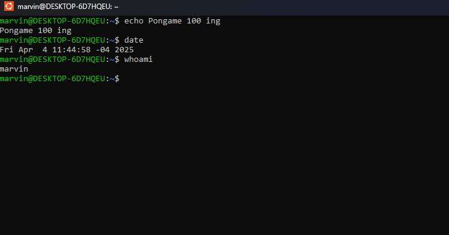

# Command Line

## The Shell 

### Comandos utilizados

| Comando     | Descripción                                      |
|-------------|--------------------------------------------------|
| echo        | Muestra un texto en la salida estándar.          |
| date        | Muestra la fecha y hora actuales.                |
| whoami      | Muestra el nombre del usuario actual.            |

---

### Ejercicios

Uso de los comandos

  

---

### Cuestionario

**1. ¿Qué debería aparecer en la pantalla cuando escribes echo Hello World?**: Hello World 

## pwd (Print Working Directory)

### Comandos utilizados

| Comando     | Descripción                                              |
|-------------|----------------------------------------------------------|
| tree        | Muestra el contenido de un directorio en forma de árbol |
| pwd         | Muestra la ruta del directorio actual |

---

### Ejercicios

Uso de los comandos

---

### Cuestionario

**1. ¿Cómo puedo saber en qué directorio estás actualmente?**: pwd

## cd (Change Directory)

### Comandos utilizados

| Comando     | Descripción                                      |
|-------------|--------------------------------------------------|
| cd /        | Cambia al directorio dentro de ruta absoluta.        |
| cd         | Cambia al subdirectorio del directorio actual.     |
| cd .      | No cambia de directorio, representa el directorio actual.       |
| cd ..        | Sube un nivel al directorio padre del actual.                |
| cd ~      | Cambia al directorio personal del usuario actual.               |
| cd -        | Cambia al último directorio visitado anteriormente.              |

---

### Ejercicios

Uso de los comandos

---

### Cuestionario

**2. Si estás en /home/pete/Pictures y quieres ir a /home/pete, ¿cuál es un buen acceso directo para usar?**: cd ..

## ls (List Directories)

### Comandos utilizados

| Comando     | Descripción                                      |
|-------------|--------------------------------------------------|
| ls         | Lista los archivos y carpetas del directorio actual.          |
| ls /        | Lista el contenido del directorio raíz                            |
| ls -a      | Muestra todos los archivos, incluyendo los ocultos (los que comienzan con .)                                |
| ls -l        | Muestra una lista detallada del contenido del directorio actual.        |
| ls -la        | Muestra una lista detallada de todos los archivos, incluyendo los ocultos.   |
| ls -R      | Lista los archivos recursivamente en todos los subdirectorios.  |
| ls -r        | Lista los archivos en orden inverso (de Z a A o del más nuevo al más antiguo, según el caso).     |
| ls -t        | Ordena los archivos por fecha de modificación (del más reciente al más antiguo).    |

---

### Ejercicios

Uso de los comandos

---

### Cuestionario

**3. ¿Qué comando usarías para ver los archivos ocultos?**: ls -a

## touch

### Comandos utilizados

| Comando     | Descripción                                      |
|-------------|--------------------------------------------------|
| touch        | Crea un archivo vacío si no existe, o actualiza su marca de tiempo si ya existe.         |

---

### Ejercicios

Uso de los comandos

---

### Cuestionario

**4. ¿Cómo se crea un archivo llamado myfile?**: touch myfile

## file

### Comandos utilizados

| Comando     | Descripción                                      |
|-------------|--------------------------------------------------|
| file        | Muestra el tipo de archivo (texto, imagen, script, binario, etc.).          |

---

### Ejercicios

Uso de los comandos

---

### Cuestionario

**5. ¿Qué comando puedes utilizar para encontrar el tipo de archivo de un archivo?**: file

## cat

### Comandos utilizados

| Comando     | Descripción                                      |
|-------------|--------------------------------------------------|
| cat        | Muestra el contenido completo del archivo en la terminal.          |

---

### Ejercicios

Uso de los comandos

---

### Cuestionario

**6. ¿Cuál es una buena manera de ver el contenido de un archivo?**: cat

## less

### Comandos utilizados

| Comando     | Descripción                                      |
|-------------|--------------------------------------------------|
| less        | Abre el archivo en un visor interactivo, permitiendo navegar por su contenido.      |
| q        | Se usa para salir de Less y volver a la consola.      |
| g        | Va al principio del archivo de texto.  |
| G      | Va al final del archivo de texto.       |
| /search        | Puedes buscar texto específico dentro del documento de texto.     |
| h        | Si necesitas ayuda sobre cómo usar Less mientras estás en Less.       |

---

### Ejercicios

Uso de los comandos

---

### Cuestionario

**7. ¿Cómo salir de un comando less?**: q
